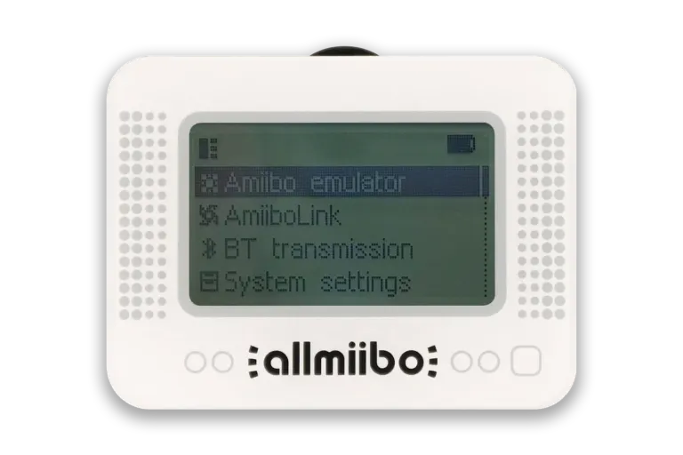

# Allmiibo Web Manager & Vault (Gestor Web Allmiibo)

  

  <strong>Gestor web moderno, intuitivo y de código abierto para dispositivos Allmiibo / Pixl.js mediante Web Bluetooth (Web BLE).</strong> 
  <em>A modern, intuitive, and open-source web manager for Allmiibo / Pixl.js devices via Web Bluetooth (Web BLE).</em>

  🌐 <strong>Web Oficial / Live App</strong>: <a href="https://allmiibo.aolabs.cl/" target="_blank" rel="noopener noreferrer"><strong>https://allmiibo.aolabs.cl/</strong></a> 
  🏢 <strong>AO Labs Chile</strong>: <a href="https://aolabs.cl/" target="_blank" rel="noopener noreferrer"><strong>https://aolabs.cl/</strong></a> | ☕ <strong>Apoyar el proyecto / Support on Ko-fi</strong>: <a href="https://ko-fi.com/aolabs" target="_blank" rel="noopener noreferrer"><strong>https://ko-fi.com/aolabs</strong></a>

  <a href="#español"> <strong>Español</strong></a> | <a href="#english"> <strong>English</strong></a> | <a href="#-aviso-legal--disclaimer">⚖️ <strong>Aviso Legal / Disclaimer</strong></a>

---

#  Español

**Allmiibo Web Manager** es una aplicación web progresiva diseñada para administrar de forma inalámbrica los archivos, carpetas, claves criptográficas y firmware en dispositivos **Allmiibo** y **Pixl.js** desde cualquier navegador compatible, sin cables, sin drivers y sin necesidad de instalar software adicional en tu equipo.

---

### 🚀 Características Principales

* 📶 **Conexión Inalámbrica Web Bluetooth (Web BLE)**: Comunícate directamente con tu Allmiibo desde el navegador con alta velocidad de transferencia (MTU 250, paquetes de 242 bytes).
* 🏪 **Bóveda y Catálogo Online Integrado (1.070+ Amiibos)**: Explora la biblioteca completa de figuras y tarjetas sincronizada en tiempo real desde la bóveda de Internet Archive y categorizada en más de 32 franquicias (Zelda, Animal Crossing Series 1-5, Sanrio, Super Smash Bros, Splatoon, Mario, Monster Hunter, etc.).
* 🎨 **Imágenes Oficiales Dinámicas**: Coincidencia inteligente de nombres que consulta e ilustra cada tarjeta con su portada oficial en alta definición desde <a href="https://www.amiiboapi.org/" target="_blank" rel="noopener noreferrer">AmiiboAPI</a>.
* ⚡ **Flasheo Directo con 1 Clic**: Instala figuras individuales o series completas directamente desde la nube a tu Allmiibo sin descargar archivos `.bin` manualmente.
* 📁 **Organización Inteligente de Carpetas**: Al instalar lotes o series grandes, el gestor estructura y desglosa automáticamente los archivos en subcarpetas optimizadas (ej. `Zelda_BotW`, `Zelda_TotK`, `AC_Series_1`), respetando estrictamente los límites de ruta del sistema de archivos LittleFS (máximo 58 bytes por ruta).
* 🔑 **Auto-instalación de Claves (`key_retail.bin`)**: Descarga con un solo clic la clave criptográfica oficial de 160 bytes directamente desde Internet Archive y la instala en la raíz de tu dispositivo para habilitar la base de datos interna.
* 🧹 **Borrado Seguro de Amiibos**: Opción para limpiar todos los archivos `.bin`/`.nfc` liberando almacenamiento mientras preserva de forma permanente tu clave `key_retail.bin` y tus partidas guardadas (`E:/amiibo/save`).
* 🔄 **Reinicio Remoto a Modo DFU**: Envía un comando Bluetooth para reiniciar el Allmiibo en modo *Device Firmware Update (DFU)* y enlaza con el instalador Web DFU oficial para actualizar el firmware del dispositivo.
* 🚀 **Simulador Virtual Integrado**: Permite probar toda la interfaz, navegar por el catálogo y simular subidas de archivos en memoria sin tener el hardware físico a mano.
* 🌐 **Bilingüe Instantáneo**: Selector de idioma fluido con banderas de Chile (🇨🇱 Español) y Reino Unido (🇬🇧 English).
* 📱 **Diseño 100% Responsivo**: Adaptado para ordenadores, tablets y teléfonos móviles.

---

### 📱 Compatibilidad de Navegadores

| Sistema Operativo | Navegadores Compatibles | Instrucciones / Notas |
| :--- | :--- | :--- |
| **Windows / macOS / Linux / ChromeOS** | Google Chrome, Microsoft Edge, Opera, Brave | Compatible de forma nativa. Solo asegúrate de tener el Bluetooth encendido en tu PC. |
| **Android** | Google Chrome, Microsoft Edge | Requiere activar **Bluetooth** y **Ubicación (GPS)** en los ajustes del teléfono. |
| **iOS (iPhone / iPad)** | App **Bluefy (Web BLE Browser)** | Apple no soporta Web Bluetooth en Safari ni Chrome. Abre <a href="https://allmiibo.aolabs.cl/">https://allmiibo.aolabs.cl/</a> dentro de la app gratuita **Bluefy** de la App Store. |

---

### 📖 Tutorial de Uso Rápido

1. **Activar Bluetooth en tu Allmiibo**: En el menú de tu Allmiibo, deslízate hasta la opción `BT transmission` (Transferencia Bluetooth) y ponla en `ON`.
2. **Conectar desde la web**: Pulsa el botón azul **"Conectar Allmiibo"** en el panel lateral y selecciona tu dispositivo en la ventana emergente.
3. **Instalar Clave (Auto-llave)**: Si tu dispositivo es nuevo, haz clic en **"Auto-llave"** en la barra lateral para configurar `key_retail.bin` con un solo clic.
4. **Subir Amiibos desde el Catálogo**: Entra a la pestaña **"Catálogo Amiibos"**, busca tus figuras o cartas favoritas y pulsa **"Instalar"** o **"Instalar Serie"**.
5. **Escanear en tu Consola**: En tu Allmiibo entra al menú `Amiibo emulator`, elige el archivo que acabas de subir y acércalo al lector NFC de tu **Nintendo Switch 1 y 2, Wii U o 3DS**.

---

#  English

**Allmiibo Web Manager** is a modern, lightweight, progressive web app created to wirelessly manage Amiibo files, directories, encryption keys, and firmware on **Allmiibo** and **Pixl.js** devices directly from your web browser via **Web Bluetooth (Web BLE)**, without cables, drivers, or companion software.

---

### 🚀 Key Features

* 📶 **Wireless Web Bluetooth (Web BLE) Connectivity**: High-speed wireless data transfer directly through the browser (MTU 250, 242-byte chunk streaming).
* 🏪 **Integrated Cloud Vault (1,070+ Amiibos)**: Comprehensive cloud library synced in real-time with Internet Archive, categorized across 32 franchises (Zelda, Animal Crossing Series 1-5, Sanrio, Super Smash Bros, Splatoon, Mario, Monster Hunter, etc.).
* 🎨 **Dynamic Official Artwork**: Intelligent name-matching engine that queries and displays official high-definition box art dynamically from <a href="https://www.amiiboapi.org/" target="_blank" rel="noopener noreferrer">AmiiboAPI</a>.
* ⚡ **1-Click Direct Flashing**: Install single figures or full series directly from the cloud to your Allmiibo without manual `.bin` downloads.
* 📁 **Smart Folder Categorization**: Batch installations automatically split into clean, short subfolders (`Zelda_BotW`, `Zelda_TotK`, `AC_Series_1`, etc.), strictly respecting LittleFS path length limits (max 58 bytes).
* 🔑 **1-Click Auto-Key Setup (`key_retail.bin`)**: Downloads the official 160-byte decryption key directly from Internet Archive and flashes it to your Allmiibo's root directory.
* 🧹 **Safe Device Wipe**: Dedicated wipe tool that deletes `.bin`/`.nfc` files while preserving `key_retail.bin` and user save files (`E:/amiibo/save`).
* 🔄 **Wireless DFU Reboot (OTA Firmware Updates)**: Send a direct Bluetooth reboot command to enter *Device Firmware Update (DFU)* mode with direct link to the Web DFU flasher.
* 🚀 **Built-in Virtual Simulator**: Test the entire UI, explore the catalog, and simulate file transfers in-memory without physical hardware.
* 🌐 **Instant Bilingual Support**: Toggle smoothly between Spanish (🇨🇱) and English (🇬🇧).
* 📱 **100% Mobile & Desktop Responsive**: Tailored layout for smartphones, tablets, and wide desktop displays.

---

### 📱 Browser Compatibility

| Operating System | Supported Browsers | Notes / Instructions |
| :--- | :--- | :--- |
| **Windows / macOS / Linux / ChromeOS** | Google Chrome, Microsoft Edge, Opera, Brave | Natively supported. Ensure Bluetooth is enabled on your PC. |
| **Android** | Google Chrome, Microsoft Edge | Requires both **Bluetooth** and **Location (GPS)** enabled in Android settings. |
| **iOS (iPhone / iPad)** | **Bluefy (Web BLE Browser)** app | Apple does not support Web Bluetooth in Safari or Chrome. Open <a href="https://allmiibo.aolabs.cl/">https://allmiibo.aolabs.cl/</a> inside the free **Bluefy** app from the App Store. |

---

### 📖 Quick Start Guide

1. **Enable Bluetooth on Allmiibo**: On your Allmiibo screen, scroll to `BT transmission` and turn it `ON`.
2. **Connect via Web**: Click the blue **"Connect Allmiibo"** button on the left sidebar and select your device in the browser pairing window.
3. **Install Encryption Key (Auto-Key)**: If setting up for the first time, click **"Auto-llave"** on the sidebar to install `key_retail.bin` with 1-click.
4. **Flash Amiibos from Catalogue**: Open the **"Catálogo Amiibos"** tab, pick your favorite figures or cards, and click **"Install"** or **"Install Series"**.
5. **Scan on your Console**: On your Allmiibo open `Amiibo emulator`, choose the file, and tap it on the NFC touchpoint of your **Nintendo Switch 1 & 2, Wii U, or 3DS**.

---

### ⚖️ Aviso Legal / Disclaimer

**Español:**  
Allmiibo Web Manager es un software libre y de código abierto desarrollado exclusivamente con fines educativos, de interoperabilidad de hardware y gestión personal de copias de seguridad. **Este sitio web y sus desarrolladores NO alojan, almacenan, distribuyen ni comercializan ningún archivo binario propietario (.bin), claves criptográficas ni imágenes con derechos de autor en sus propios servidores.** Cualquier descarga se realiza bajo demanda y a solicitud directa del usuario desde repositorios públicos de terceros (AmiiboAPI y Archive.org). Nintendo®, Amiibo®, Nintendo Switch®, Nintendo Switch 2®, Wii U®, 3DS® y todos los nombres, personajes, marcas y logotipos asociados son marcas registradas de Nintendo Co., Ltd. Este proyecto es una herramienta comunitaria independiente y no está respaldado ni afiliado con Nintendo.

**English:**  
Allmiibo Web Manager is a free, open-source community tool developed solely for educational, hardware interoperability, and personal backup management purposes under Fair Use. **This website and its developers DO NOT host, store, mirror, distribute, or sell any proprietary binary files (.bin), encryption keys, or copyrighted artwork on their own servers.** All metadata, files, and artwork are retrieved on-demand from public third-party sources (AmiiboAPI and Archive.org). Nintendo®, Amiibo®, Nintendo Switch®, Nintendo Switch 2®, Wii U®, 3DS®, and all related character names, marks, and logos are registered trademarks of Nintendo Co., Ltd. This project is not affiliated with or endorsed by Nintendo.

---

### ☕ Apoyar el Proyecto / Support the Project

Desarrollado con ♥ por **AO Labs Chile** (<a href="https://aolabs.cl/" target="_blank" rel="noopener noreferrer">https://aolabs.cl/</a>).  
Si este proyecto te ha sido de utilidad y deseas apoyar su mantenimiento y desarrollo continuo, ¡puedes invitarnos a un café!:

👉 **Ko-fi**: <a href="https://ko-fi.com/aolabs" target="_blank" rel="noopener noreferrer"><strong>https://ko-fi.com/aolabs</strong></a>

